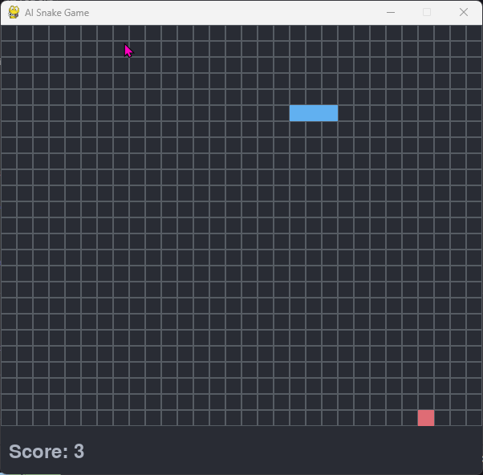

# AI Snake Game

A classic Snake game built with Python and Pygame, enhanced with AI capabilities using Deep Q-Learning (DQN) in PyTorch.



## Overview

This project features a complete Snake game with a main menu, manual play mode, and an AI agent trained via Deep Q-Learning. The AI uses a neural network with experience replay, a target network, and epsilon-greedy exploration to learn how to play the game effectively.

### Project Structure

| Module                | Purpose                                                                         |
| --------------------- | ------------------------------------------------------------------------------- |
| `snake-game-entry.py` | Main entry point, game loop, menu system, game state machine                    |
| `snake.py`            | Snake class with movement, growth, wrapping, and collision logic                |
| `food.py`             | Food class with random positioning                                              |
| `game.py`             | Pygame rendering functions (grid, menu, training progress, game over)           |
| `ai_trainer.py`       | Deep Q-Learning agent with neural network, training loop, and model persistence |
| `constants.py`        | Configuration constants (colors, grid dimensions, cell size)                    |

## Game Features

- **Grid wrapping**: The snake wraps around screen edges instead of dying on wall collision
- **Dynamic difficulty**: Game speed increases progressively as your score grows
- **Held-key support**: Keys repeat when held for responsive controls
- **One Dark theme**: Dark-themed visual style with configurable colors

## Setup Instructions

### Clone the Repository

```bash
git clone https://github.com/alouiadel/ai-snake-game.git
cd ai-snake-game
```

### Set Up Virtual Environment

```bash
# Create a virtual environment
python -m venv venv

# Activate the virtual environment
# On Windows
venv\Scripts\activate
# On macOS/Linux
# source venv/bin/activate

# Install requirements
pip install -r requirements.txt
```

For CUDA-enabled PyTorch, visit [PyTorch Get Started](https://pytorch.org/get-started/locally/).

## Usage

```bash
python snake-game-entry.py
```

### Menu Options

1. **Play** - Play the game manually using arrow keys
2. **Train AI** - Train the AI agent (enter episode count from 1 to 1000)
3. **Watch AI Play** - Watch a trained AI play (requires a trained model in `models/`)
4. **Quit** - Exit the game

### Controls

- Up Arrow: Move Up
- Down Arrow: Move Down
- Left Arrow: Move Left
- Right Arrow: Move Right
- Y: Play again after game over
- N: Return to menu after game over

### Game Over

Press Y to play again or N to return to the main menu.

## AI Details

### Architecture

The AI uses a Deep Q-Network (DQN) with the following structure:

- **Neural network**: 11 inputs -> 256 -> 128 -> 4 outputs (fully connected, ReLU activations on hidden layers)
- **Input state (11 features)**: danger straight/left/right (3), current direction (4), food position relative to head (4)
- **Output**: Q-values for 4 actions (up, down, left, right)

### Training

- **Algorithm**: Deep Q-Learning with experience replay and target network
- **Replay buffer**: 100,000 past experiences
- **Batch size**: 64
- **Discount factor (gamma)**: 0.95
- **Epsilon-greedy**: Starts at 1.0, decays by 0.995 per step, minimum 0.01
- **Target network update**: Every 10 episodes
- **Optimizer**: Adam (learning rate 0.001)
- **Loss function**: MSELoss

### Reward Function

| Event                  | Reward                                       |
| ---------------------- | -------------------------------------------- |
| Eating food            | +10                                          |
| Dying (self-collision) | -10                                          |
| Default                | -0.1 x normalized Manhattan distance to food |

### Model Persistence

Trained models are saved to the `models/` directory (not tracked in git). Each save creates a timestamped file plus a `latest_model.pth` / `latest_metadata.pt` copy for easy reloading.

### GPU Support

The training automatically uses CUDA if a compatible GPU is available.

## Configuration

All game constants can be tweaked in `constants.py`:

- **Grid size**: 30 x 25 cells
- **Cell size**: 20 x 20 pixels
- **Screen resolution**: 600 x 560 pixels
- **Color scheme**: One Dark palette (background, snake blue, food red, border grey, text light grey)

## Requirements

- Python 3.x
- Pygame
- PyTorch
- NumPy

## License

This project is licensed under the MIT License - see the [LICENSE](LICENSE) file for details.
